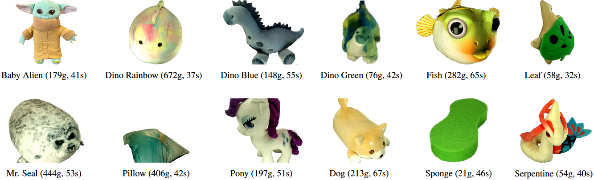

# The Plush Dataset

We present the Plush Dataset, part of our work on [Virtual Elastic Objects](https://hsiaoyu.github.io/VEO/).

For each of a dozen plush toys, the dataset contains a scene with:
* synchronized multi-view RGB video recordings,
* their intrinsic and extrinsic camera calibrations, 
* the physical forces acting on the plush toy, 
* our 3D reconstructed point clouds with temporal correspondences, 
* our simulated results when using the ground-truth point clouds or our physically simulated point clouds.



## Download The Plush Dataset
The dataset is managed using the Git Large File Storage system. To download the dataset, please do the following steps:
1. Install git LFS from : https://git-lfs.github.com/
2. Run `git lfs install`
3. `git clone https://github.com/facebookresearch/plush_dataset.git`

## Folder Structure

The repository contains one subfolder per object. Each of the object folders contains three subfolders: `capture`, `reconstruction`, and `simulation`.

### Capture

This folder contains information from the capture rig. The raw camera data is available in H265 encoded .mp4 files, for cameras 1 up to including 19, in format `cam%04d.aligned.mp4` (for example, `cam0001.aligned.mp4`) for the center color sensor, and with `.left` and `.right` for the two attached monochrome sensors (for example, `cam0001.left.aligned.mp4`). **All of the camera data must be rotated 90 degrees counterclockwise to be used with the calibration data** (for example, using `cv2.rotate(frame, cv2.ROTATE_90_COUNTERCLOCKWISE)`)!

In addition to the camera data, this folder also contains the calibration data and the path of the ArUco marker attached to the air compressor. Both are stored in JSON format and are in principle human readable.

The calibration is stored in a dictionary per camera (for example, `cam0001`) in OpenCV format. For each camera, it contains `distortion` parameters (12 of them, for the thin-prism lens model), `extrinsic` parameters (4x4 RT matrix using OpenCV convention) and `intrinsic` matrix (3x3 matrix using OpenCV convention). It also contains a field `resolution_w_h`, which contains the resolution width and height as 2-tuple - the resolution is different for color and monochrome sensors.

The ArUco information is stored in the file `aruco_path.json`. It contains a list of dictionaries with one entry per frame. If no marker was detected in a frame, the list contains `null` (`None` when loaded in Python). If there was a detection, the list contains a dictionary with the following fields: `aruco_ids` (always contains exactly one ID, 164), `rvecs` and `tvecs` (OpenCV ArUco tracking format 3x3 rotation matrix and 3x1 translation vector). These are in the world coordinate system (the same as of cam0001). Rotation and translation are in marker-to-cam format (i.e., you can use `cv2.projectPoints` with these parameters to project the marker center as (0, 0, 0) into the image). If you want to do this for an arbitrary camera, you can simply left-multiply the camera's rotation matrix with `rvecs` and `tvecs`, then add the camera's translation vector to `tvecs`.

### Reconstruction

Each folder has a `reconstruction` subfolder, which contains consecutively numbered reconstruction `npz` files and an `rgbs.npy` file. 

The `npz` files can be opened as follows:
```
import numpy as np
import os
vertices = np.load(os.path.join(plush_folder, "reconstruction", "00000000.npz"))["vertices"]
mask = torch.load(os.path.join(plush_folder, "reconstruction", "mask.pt"))
verts_object = vertices[mask["objectInd"]] # cleaned point cloud
verts_fixed = verts_object[mask["fixed"]] 
```
where `vertices` is a `100.000 x 3` float32 numpy array, containing the 3D vertex positions. The vertices are in temporal correspondence across the files. 

We remove undesired points by selecting only the vertex indices of the object in the `objectInd` field of `mask.pt`. We also store the indices of the subset of the cleaned point cloud that were attached to the strings or taped to the ground in the `fixed` field.

The `rgbs.npy` file can be loaded with `rgb = np.load(os.path.join(plush_folder, "reconstruction", "rgbs.npy"))`. It is a `100.000 x 3` float32 numpy array, containing the RGB color (in [0,1]) of each vertex. 

### Simulation

Under each simulation folder, there are two subfolders `val_GT` and `val_simed`, which are the grouth-truth validation set from the reconstruction and the simulated result of our trained model that were used to evaluate the performance in the paper. Additional information on how we conduct the simulation can be found in the `simInfo.pt`, which records the frames we used for training the model, the frames we used for validation, and the subset of points that were used for simulation.

The `simInfo.pt` can be accessed as follows:
```
import torch
simInfo = torch.load(os.path.join(plush_folder, "simulation", "simInfo.pt"))
trainingIndices = simInfo["trainingInd"] # the frames used for trainging
validationIndices = simInfo["valInd"] # the frames used for validation
sampledVerts = simInfo["sampledVerts"] # the vertex indices from the reconstruction used in the simulation
```

### Physical Forces

The physical forces from the airstream are recorded in `capture/aruco_path.json`. The position of the source of the airstream force and its direction can be obtained as follows:
```
import json
camInfo = json.load(os.path.join(plush_folder, "capture", "aruco_path.json")
tvecs = camInfo[frameIndex]["tvecs"]
rvecs = camInfo[frameIndex]["rvecs"]
pos = torch.matmul(torch.tensor(rvecs), torch.FloatTensor([0,105,0])) + torch.FloatTensor(tvecs)
dir = torch.matmul(torch.tensor(rves), torch.FloatTensor([0,0,-1]))
pos[:,1:3] = -pos[:,1:3] 
dir[:,1:3] = -dir[:,1,3]
```
These transformations are necessary because the airstream source is located 10.5 cm above the marker center and ejects air in the `(0,0,-1)` direction. The final two lines flipped the position and direction to match the reconstruction.

## License

The dataset is available under the Creative Commons CC-BY-NC 4.0 license (see the LICENSE file).

## Cite

If you are using this dataset, please cite our work:

```
@InProceedings{Chen_VEO,
    author = {Hsiao-yu Chen and Edith Tretschk and Tuur Stuyck and Petr Kadlecek and Ladislav Kavan and Etienne Vouga and Christoph Lassner},
    title  = {Virtual Elastic Objects},
    booktitle = {IEEE/CVF Conference on Computer Vision and Pattern Recognition (CVPR)},
    month = {June},
    year = {2022}
}
```
